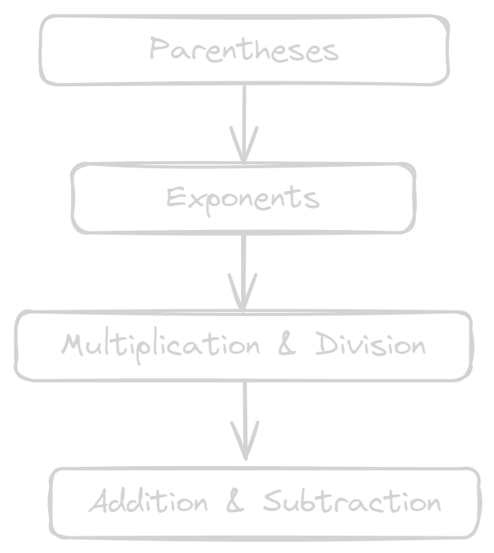

# 05 | Basic Syntax

## Modules

- [01 - Housekeeping](01-housekeeping.md)
- [02 - Python the Language](02-python-the-language.md)
- [03 - Your Engineering System](03-your-engineering-system.md)
- [04 - Jupyter Notebooks 101](04-jupyter-notebooks-101.md)
- [05 - Basic Syntax](05-basic-syntax.md)
- [06 - Data Structures](06-data-structures.md)
- [07 - Control Flow](07-control-flow.md)
- [08 - Functions](08-functions.md)

---

## The Real Beginning

This is the real beginning. Syntax is the grammar of Python. Get it right and you can express anything. Most of what follows looks simple on paper, but the concepts form the backbone of every project you'll build later. Don't rush—repetition is where fluency comes from.

## Indentation

Python uses indentation to define code blocks. Four spaces is the convention; stick with it and life stays easy.

```python
if 5 > 2:
    print("Five is greater than two!")
```

If you skip the indentation, Python raises an error immediately. That immediate feedback is a feature, not a pain point.

## Comments

Comments are the notes you leave for future-you (and everyone else who reads the code). Use `#` for single-line comments and triple quotes for longer documentation blocks when needed.

```python
# Tributary area in square metres
tributary_area = span * spacing
```

## Variables and Primitive Types

Python creates a variable as soon as you assign a value to it. The interpreter infers the type.

```python
my_integer = 10          # int
my_float = 20.5          # float
is_coding_fun = True     # bool
favourite_language = "Python"  # str
```

A quick refresher on naming rules:

- Start with a letter or underscore.
- Use letters, numbers, and underscores only.
- Names are case-sensitive.

Python keeps a list of reserved keywords you cannot use as variable names (`for`, `if`, `return`, etc.). Hit `help("keywords")` in the interpreter to see the latest list.

## Expressions vs Statements

- **Expressions** produce a value.

    ```python
    2 + 3
    len("beam")
    ```

- **Statements** perform an action.

    ```python
    x = 5
    print(x)
    ```

Many statements contain expressions; understanding the difference helps when we talk about control flow.

## Order of Operations

Python follows the same rules you learned in school: **P**arentheses, **E**xponents, **M**ultiplication, **D**ivision, **A**ddition, **S**ubtraction.



Examples:

```python
result = 2 + 3 * 4      # 14
result = (2 + 3) * 4    # 20
result = 2 ** 3 * 4     # 32
```

## Arithmetic Operators

| Operator | Description | Example | Result |
| --- | --- | --- | --- |
| `+` | Addition | `5 + 3` | `8` |
| `-` | Subtraction | `5 - 3` | `2` |
| `*` | Multiplication | `5 * 3` | `15` |
| `/` | Division (always float) | `5 / 2` | `2.5` |
| `//` | Floor division | `5 // 2` | `2` |
| `%` | Modulus (remainder) | `5 % 2` | `1` |
| `**` | Exponentiation | `5 ** 3` | `125` |

A few reminders:

- Division always returns a float. Use `//` when you need integer results.
- Modulus is handy for checking divisibility; for example,  `n % 2 == 0` checks for even numbers. 
- Exponentiation uses `**`, not `^`.

## Debugging Without Panic

Errors are part of the process. You will run into three main categories:

1. **Syntax errors** - Python cannot even run the code. Missing colons or indentation slips cause these.
2. **Runtime errors** - The code runs and then breaks (e.g. dividing by zero, missing files).
3. **Logical errors** - The code runs, but the result is wrong. These require reasoning and instrumentation.

Strategies that work:

- Read the error message. It tells you the line and usually the reason.
- Sprinkle `print()` statements or use breakpoints in VS Code to inspect variables.
- Reduce the problem to the smallest snippet that still fails.
- Explain the code out loud (rubber duck debugging). **It's amazing how often you catch the issue mid-sentence.**

Keep your notebooks or scripts tidy, name variables clearly, and errors become easier to hunt down.

(c) Flocode, 2025
