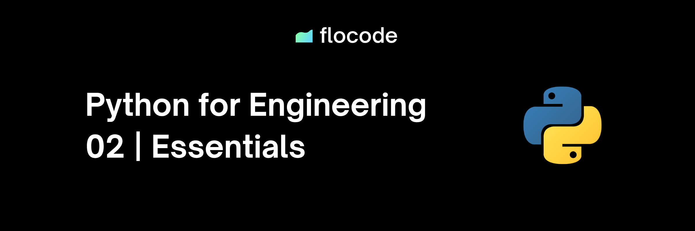
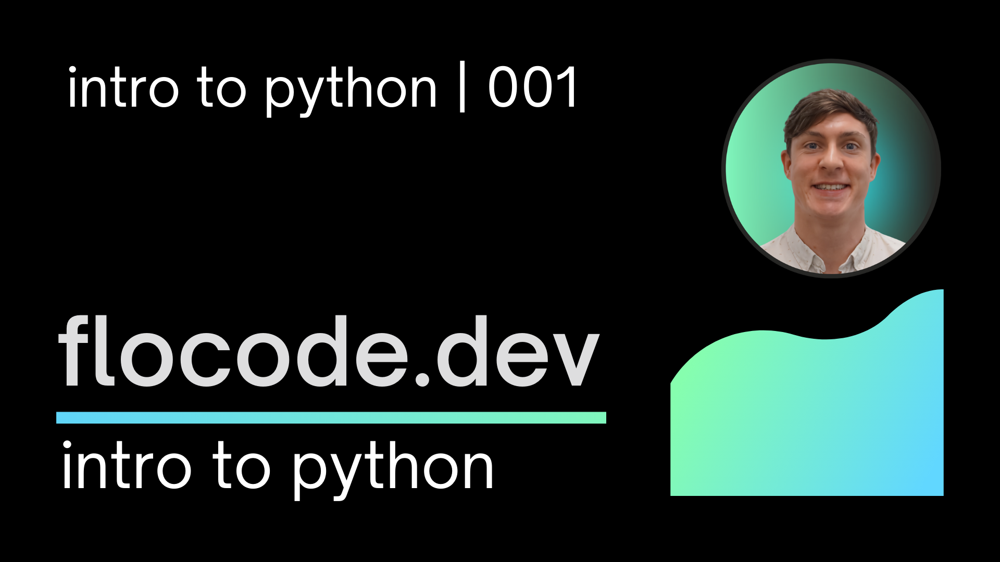
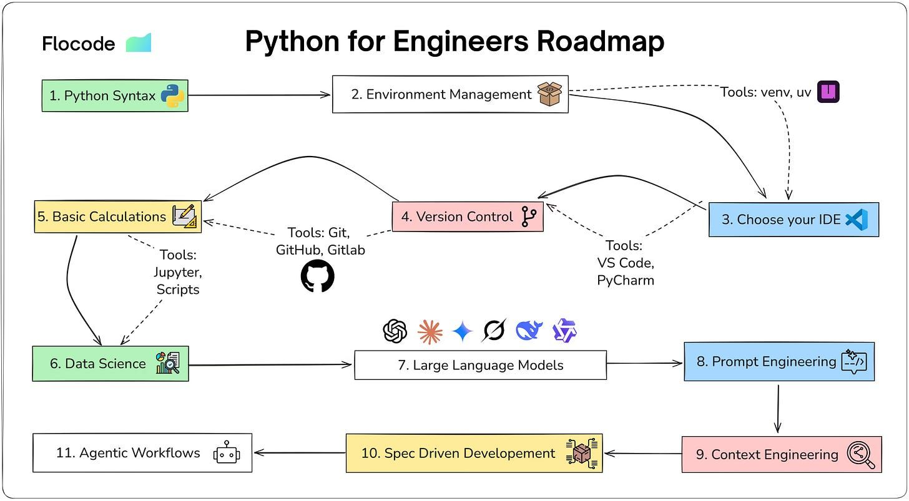

# Flocode | Python Essentials

Welcome to the Essentials track. This is the foundation of the Flocode curriculum and the starting point for engineers who want to put Python to work in the real world.

If you're completely new to Python for Engineering, you can also check out the [Introductory Course on Youtube](https://www.youtube.com/watch?v=VzvxLa2XMHo&list=PLjbxCdRUFyavq7ZhqqA5IsVD7uf5-szoU) which provides a higher level overview of the topic.

If you find this material valuable, consider sharing it with your team or supporting the work through the [Flocode Newsletter](https://flocode.dev/newsletter). The more engineers we help, the better our industry becomes.

---

## Modules

- [01 - Housekeeping](01-housekeeping.md)
- [02 - Python the Language](02-python-the-language.md)
- [03 - Your Engineering System](03-your-engineering-system.md)
- [04 - Jupyter Notebooks 101](04-jupyter-notebooks-101.md)
- [05 - Basic Syntax](05-basic-syntax.md)
- [06 - Data Structures](06-data-structures.md)
- [07 - Control Flow](07-control-flow.md)
- [08 - Functions](08-functions.md)

---

## Overview

Get ready to unlock the power of Python for engineering problems. Whether you are moving beyond spreadsheets or sharpening existing skills, this course gives you the tools, vocabulary, and mindset to automate work, analyse data, and build dependable workflows.

What you will learn:

- **Python fundamentals** - syntax, variables, data types, control flow, and functions.
- **Engineering-centric applications** - how Python supports structural calculations, reporting, and automation.
- **Tools of the trade** - practical workflows with uv, VS Code, and Jupyter notebooks.
- **A repeatable process** - how to decompose messy problems into code-sized building blocks.

## How to Approach the Essentials

- Be patient with the basics. A solid foundation makes the advanced topics straightforward.
- Set aside 2-6 hours per week and guard the time. Consistency beats intensity.
- Type the examples out. Break them, fix them, and tweak them. Muscle memory matters.
- Build small personal projects. Automate a report, study a dataset, or tidy a workflow at work.
- Swap notes with other engineers. Share questions and lessons learned—the collaboration pays off more than you expect.
- Read the docs. Python's documentation (and most libraries you will touch) is excellent. Make it a habit.

## Python Roadmap

This roadmap reflects my own path learning Python. Each node represents a deep topic, multiple careers span any single one of these areas. You don't need to become an expert in every node to use Python effectively. The goal is gradual understanding of the landscape, which gives you freedom and control whether you're scripting simple tasks, automating workflows, or building enterprise-level tools.

Treat it as a map, not a checklist.

## A Note Before You Start

Coding feels awkward and confusing at the beginning. That friction is normal. Focus on steady effort, keep notes on what you try, and expect plateaus as well as breakthroughs. You may feel overwhelmed at the scope of the terminology and systems, that's also normal. 

Mastery comes from repeatedly breaking problems down, testing ideas, and tightening the loop between thinking, writing code, and reviewing the results.

> "Measurement is the first step that leads to control and eventually to improvement. If you can't measure something, you can't understand it. If you can't understand it, you can't control it. If you can't control it, you can't improve it." - H. James Harrington

## Prerequisites

There are no formal prerequisites. If you are brand new to programming, the free [Flocode Intro](https://flocode.dev/intro) is a quick primer, but you can jump straight in here.

## Quick Resources

These references stay public and stable:

- [Python.org Downloads](https://www.python.org/downloads/)
- [uv documentation](https://docs.astral.sh/uv/)
- [Visual Studio Code](https://code.visualstudio.com/)
- [Project Jupyter](https://jupyter.org/install)
- [PyPI package index](https://pypi.org/)
- [NumPy documentation](https://numpy.org/doc/stable/)
- [Pandas documentation](https://pandas.pydata.org/pandas-docs/stable/)
- [Matplotlib documentation](https://matplotlib.org/stable/)
- [SciPy documentation](https://docs.scipy.org/doc/scipy/)
- [GitHub Guides](https://docs.github.com/en/get-started/quickstart)

## Final Word

You do not need to memorise Python. You need to learn how to think with it. Treat every module as a set of tools you can mix and match. Document what you try, share your wins, and send suggestions my way so the next engineer who lands here gets an even better experience.

See you on the inside.

James
